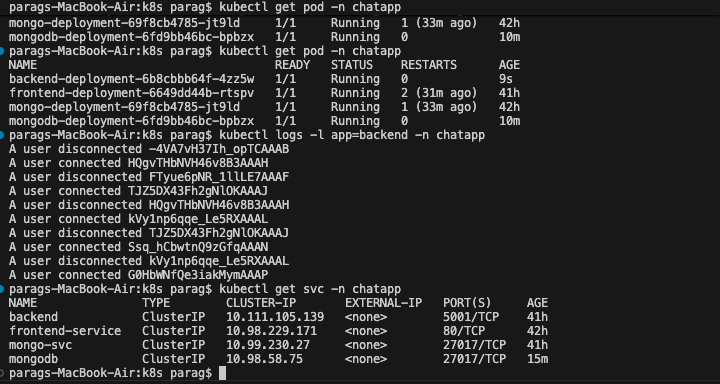

# Kubernetes Deployment Guide

This guide documents how to deploy the chat application stack onto a Kubernetes cluster, manage sensitive configuration, and operate the workload day-to-day. The manifests were authored and tested on Minikube, but work on any conformant cluster with equivalent resources.

> This project is a Kubernetes-focused fork of `iemafzalhassan/full-stack_chatApp`. The original frontend and backend code come from that repo; all `k8s/` manifests were authored in this fork to enable cluster-ready deployments.

## Prerequisites

- Kubernetes cluster v1.24+ with `kubectl` access
- Docker-compatible container registry (Docker Hub, GHCR, ECR, etc.)
- Local tooling: `kubectl`, `docker`, `helm` (optional), and access to this repository
- TLS-enabled ingress controller if exposing the app publicly
- DNS record pointing to your ingress controller (optional but recommended)

## Repository Layout

```

├── backend/              # Node.js/Express API
├── frontend/             # Vite/React UI served by NGINX
└── k8s/                  # Kubernetes manifests
    ├── namespace.yml
    ├── secret.yml
    ├── mongo-pv.yml
    ├── mongo-pvc.yml
    ├── mongo-svc.yml
    ├── deploy-mongo-db.yml
    ├── deploy-backend.yml
    ├── backend-svc.yml
    ├── deploy-frontend.yml
    └── frontend-svc.yml
├── docker-compose.yml    # Local dev stack
|── Jenkinsfile           # CI/CD pipeline example
```

## Build and Push Images

```bash
# Backend API
cd full-stack_chatApp/backend
docker build -t <registry>/<org>/chat-backend:<tag> .
docker push <registry>/<org>/chat-backend:<tag>

# Frontend client (served with NGINX)
cd ../frontend
docker build -t <registry>/<org>/chat-frontend:<tag> .
docker push <registry>/<org>/chat-frontend:<tag>
```

Update the image references inside `k8s/deploy-backend.yml` and `k8s/deploy-frontend.yml` with the pushed tags.

## Configure Secrets

Populate `k8s/secret.yml` with base64-encoded values (use `echo -n 'value' | base64`):

| Key | Purpose |
| --- | --- |
| `JWT_SECRET` | Token signing secret |
| `MONGO_URI` | In-cluster MongoDB connection string |
| `CLOUDINARY_CLOUD_NAME` | Cloudinary account name |
| `CLOUDINARY_API_KEY` | Cloudinary API key |
| `CLOUDINARY_API_SECRET` | Cloudinary API secret |

Apply the secret before deploying workloads: `kubectl apply -f k8s/secret.yml`.

## Deployment Steps

```bash
cd full-stack_chatApp

# 1. Namespace
kubectl apply -f k8s/namespace.yml
kubectl config set-context --current --namespace=chat-app

# 2. MongoDB stateful resources
kubectl apply -f k8s/mongo-pv.yml
kubectl apply -f k8s/mongo-pvc.yml
kubectl apply -f k8s/mongo-svc.yml
kubectl apply -f k8s/deploy-mongo-db.yml

# 3. Secrets + backend
kubectl apply -f k8s/secret.yml
kubectl apply -f k8s/backend-svc.yml
kubectl apply -f k8s/deploy-backend.yml

# 4. Frontend
kubectl apply -f k8s/frontend-svc.yml
kubectl apply -f k8s/deploy-frontend.yml
```

> `kubectl apply -f k8s/` also works after the namespace exists, but applying in the order above makes troubleshooting easier.

## Verifying the Deployment

- `kubectl get pods,svc` to ensure pods are `Running` and services have `ClusterIP`/`LoadBalancer` addresses
- `kubectl logs deploy/chat-backend -f` to follow backend logs
- `kubectl port-forward svc/frontend-svc 8080:80` for local smoke-testing if ingress is unavailable
- `kubectl describe` resources to diagnose CrashLoopBackOff, ImagePull errors, or unsatisfied PVCs



## Operations Cheat Sheet

- Rolling update: edit deployment image tag(s) and reapply manifest(s)
- Scale horizontally: `kubectl scale deploy/chat-backend --replicas=3`
- Restart pods: `kubectl rollout restart deploy/chat-frontend`
- Back up MongoDB: `kubectl exec` into the Mongo pod and run `mongodump` or bind a CronJob to the PVC
- Tear down: `kubectl delete -f k8s/ --ignore-not-found`

## Troubleshooting

- `Pending` pods usually mean missing PVC binding or insufficient cluster resources
- `ImagePullBackOff` implies bad registry credentials or incorrect image tags
- 5xx errors from the frontend typically trace to the backend service DNS—ensure the frontend config points to `http://backend-svc:5000` (default)
- After rotating secrets, rerun `kubectl apply -f k8s/secret.yml` and restart the affected deployments

## Next Enhancements

- Add ingress resources for HTTPS traffic
- Configure Horizontal Pod Autoscalers for backend/frontend
- Automate image builds + `kubectl apply` via the provided `Jenkinsfile`
